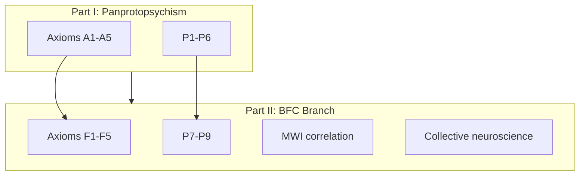

# Cosmopsychism, MWI, and Collective Consciousness

**Part II of the Panpsychism Research Program** | Branching Fragmentation Cosmopsychism (BFC)

Version 1.0 | Dual-track extension of [`PANPSYCHISM_RESEARCH.md`](PANPSYCHISM_RESEARCH.md)

---

## Executive Summary

This branch inverts the standard panpsychist move: instead of asking how micro-experience **combines** into macro-subjects, it asks how a **cosmic experiential field fragments** into local subjects—and whether **MWI branching** and **collective neuroscience** illuminate that process.

| Claim | Status |
|-------|--------|
| Cosmic experiential field (cosmopsychism) | Research hypothesis |
| Fragmentation via neural/social filters | Testable at P9, P7 |
| MWI as fragmentation mechanism | Speculative correlation |
| Collective we-states as re-coupling | P7 empirical target |
| Proof | **Not achieved** |

**Strongest honest claim:**

> MWI offers a no-collapse **fragmentation metaphor** compatible with cosmopsychism; **hyperscanning collective flow** is the nearest empirical testbed. Together they reframe the combination problem as a **multi-scale fragmentation-and-binding** program.

---

## 1. Relation to Base Program



- **Not a replacement** for Russellian panprotopsychism
- **Extends** when combination problem motivates cosmopsychism
- Shares global falsifiers G1–G4 and illusionism threat

Full axioms: [`cosmopsychism_axioms.md`](cosmopsychism_axioms.md)

---

## 2. Branching Fragmentation Cosmopsychism (BFC)

### Core thesis

1. **F1**: One cosmic experiential field
2. **F2**: Individuals = **filtered fragments**, not separate substances
3. **F3**: MWI decoherence/branching = speculative **perspective fixation** without collapse
4. **F4**: Group ritual, flow, shared delusion = temporary **re-coupling**
5. **F5**: Psychosis/psychedelic overflow = **filter failure** (disorganized bleed)

### Filter model

```
Cosmic field → [MWI branching] → Neural filter → Local subject
                                      ↓
                            Collective coupling (temporary)
                                      ↓
                            Re-filter / filter failure
```

---

## 3. MWI Correlation

Full mapping: [`mwi_consciousness_correlation.md`](mwi_consciousness_correlation.md)

| MWI | BFC |
|-----|-----|
| Universal wavefunction | Cosmic field structure |
| Branching | Fragmentation |
| Branch history | Local experiential world |
| No collapse | Filtering without experiential collapse |

### Why it helps

- Avoids summing electron-minds
- Explains privacy via branch/context isolation
- Wallace-style structure without collapse

### Why it hurts

- Experience multiplication across branches
- Preferred basis problem
- No empirical access to other branches

**Program stance:** Correlation, not identity. MWI not proven; BFC not proven.

---

## 4. Collective Consciousness as Empirical Face

Review: [`empirical/collective_integration_review.md`](empirical/collective_integration_review.md)

| Phenomenon | BFC mode | Prediction |
|------------|----------|------------|
| Guitar duets, cooperation | COLLECTIVE_COUPLING | P7: inter-brain coupling |
| Choral / ritual | COLLECTIVE_COUPLING | Organized we-states |
| Shared psychosis | FILTER_FAILURE | P8: pathological coupling |
| Mass movements | COLLECTIVE_COUPLING (weak) | Behavioral synchrony |

### P7 vs P8 distinction

- **P7 organized fusion**: high coupling + structured integration
- **P8 filter failure**: high bleed/entropy + disorganized integration

If psychosis and ritual show **identical** profiles, P8 fails.

---

## 5. Predictions P7–P9

Catalog: [`predictions.md`](predictions.md)

| ID | Prediction | Confidence |
|----|------------|------------|
| P7 | Irreducible cross-brain coupling in group flow | Weak–moderate |
| P8 | Filter failure vs organized fusion distinguishable | Weak |
| P9 | Waking = high within-brain, suppressed cross-brain | Weak |

MWI-specific falsifiers: MWI-F1–F3 in predictions.md.

---

## 6. Computational Models

| Script | Role |
|--------|------|
| [`empirical/consciousness_metrics.py`](empirical/consciousness_metrics.py) | Shared phi-analog, binding, filter helpers |
| [`empirical/fragmentation_model.py`](empirical/fragmentation_model.py) | FRAGMENTATION, BRANCHING, COLLECTIVE_COUPLING, FILTER_FAILURE |
| [`empirical/combination_model.py`](empirical/combination_model.py) | Base-track combination (Part I) |

```bash
python research/empirical/fragmentation_model.py
```

**Caveat:** Models research hypotheses; not detection of cosmic or branch experience.

---

## 7. Reasoning Infrastructure

[`core/enhanced_consciousness_reasoning.py`](../core/enhanced_consciousness_reasoning.py):

- `ConsciousnessReasoningMode.COSMOPSYCHIST`
- `ConsciousnessReasoningMode.MWI_FRAGMENTATION`
- `perform_cosmopsychist_reasoning()`
- `perform_mwi_fragmentation_analysis()`

```python
import asyncio
from core.enhanced_consciousness_reasoning import EnhancedConsciousnessReasoning

async def explore_bfc():
    r = EnhancedConsciousnessReasoning("bfc_agent", depth_level=3)
    await r.perform_cosmopsychist_reasoning()
    await r.perform_mwi_fragmentation_analysis()

asyncio.run(explore_bfc())
```

---

## 8. Tier 3 Protocol: Hyperscanning Collective Flow (P7)

1. **Subjects**: Dyads/triads
2. **Conditions**: Passive co-viewing → conversation → joint improvisation
3. **Metrics**: Inter-brain PLV, transfer entropy, PCI-analog per brain + coupling term
4. **Subjective**: We-ness scales, micro-phenomenological interviews
5. **Controls**: Shuffled dyads; matched stimulus without interaction
6. **Prediction**: Improvisation > conversation > passive for irreducible coupling

---

## 9. Evidence Status

Ledger: [`evidence_ledger.json`](evidence_ledger.json) — `bfc_branch`, P7–P9 entries.

| Criterion | Status |
|-----------|--------|
| Fragmentation problem addressed | Partial (filter model) |
| MWI mechanism established | No (speculative) |
| P7 collective evidence | Weak–moderate (literature) |
| P8 filter failure distinction | Insufficient data |
| In silico fragmentation model | Prototype |

---

## 10. Honest Limits

1. Does **not** prove MWI, cosmopsychism, or panpsychism
2. Does **not** access other branches empirically
3. Group psychosis is **not** literal mind-merge proof
4. Filter model may reduce to IIT-only at neural scale (P9-F3)
5. Illusionism (G1) still refutes entire program

---

## 11. What Would Strong Support Look Like

1. P7: irreducible cross-brain coupling with we-ness correlation
2. P8: organized ritual vs psychosis occupy distinct entropy–integration regions
3. P9: anesthesia reduces within-brain integration without cross-brain merger
4. Fragmentation problem has no fatal objection beyond combination's level
5. MWI remains viable interpretation with documented indexicality response

Still **best explanation**, not proof.

---

## 12. File Index

```
research/
├── cosmopsychism_axioms.md
├── mwi_consciousness_correlation.md
├── COSMOPSYCHISM_MWI_RESEARCH.md          (this document)
├── predictions.md                          (P7-P9)
├── evidence_ledger.json                      (bfc_branch)
└── empirical/
    ├── collective_integration_review.md
    ├── consciousness_metrics.py
    └── fragmentation_model.py
```

---

## References

- Chalmers, D. (2013). Panpsychism and panprotopsychism.
- Korman, J., & Schneider, N. (2017). Cosmopsychism and individual consciousness.
- Wallace, D. (2012). *The Emergent Multiverse*.
- Albert, D. (1992). *Quantum Mechanics and Experience*.
- Sänger, J., et al. (2012). Hyperscanning guitar duets.
- Hasson, U., et al. (2012). Brain-to-brain coupling.

See [`literature_review.md`](literature_review.md) sections 11–16.

---

## Part III: Field Excitation Ontology

Unifies Parts I–II under **localized excitation** metaphor (F6–F8):

- Creativity as structured mode exploration (P10–P12)
- Phi fix in fragmentation_model (multi-node subjects)
- Phase B Kuramoto physics gated on Phase A discrimination

Full synthesis: [`FIELD_EXCITATION_RESEARCH.md`](FIELD_EXCITATION_RESEARCH.md)

Key artifacts:
- [`field_excitation_ontology.md`](field_excitation_ontology.md)
- [`CREATIVITY_AND_CONSCIOUSNESS.md`](CREATIVITY_AND_CONSCIOUSNESS.md)
- [`empirical/field_excitation_model.py`](empirical/field_excitation_model.py)
- [`run_field_excitation_program.py`](run_field_excitation_program.py)
