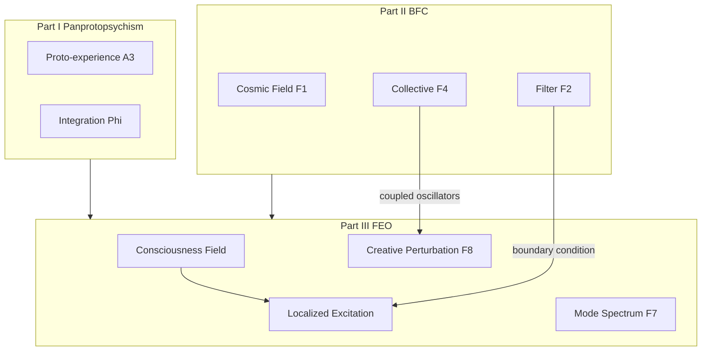

# Field Excitation Ontology, Creativity, and Consciousness

**Part III of the Panpsychism Research Program** | Field Excitation Ontology (FEO)

Version 1.0 | Extends [`PANPSYCHISM_RESEARCH.md`](PANPSYCHISM_RESEARCH.md) and [`COSMOPSYCHISM_MWI_RESEARCH.md`](COSMOPSYCHISM_MWI_RESEARCH.md)

---

## Executive Summary

Part III unifies Parts I–II under one physical metaphor:

> The consciousness field is fundamental. **You are a localized, stable excitation** in that field. Brains are **boundary conditions**. Creativity is **structured mode exploration**; psychosis is **filter failure**; group flow is **coupled excitations**.

| Claim | Status |
|-------|--------|
| Field excitation ontology (F6–F8) | Research hypothesis |
| Creativity as mode exploration (F8) | Testable via P10–P12 |
| Phi bug fixed in fragmentation model | Implemented (multi-node subjects) |
| Physical consciousness field | **Not established** |
| Proof | **Not achieved** |

**Strongest honest claim:**

> Subjectivity is best modeled as **localized excitation in a consciousness field**; creativity is **structured mode exploration**; group flow and psychosis are **coupled vs decoherent** field dynamics—testable at neural scale via P7–P12, not provable as fundamental physics yet.

---

## 1. Relation to Prior Parts



- **F1–F5** become special cases of field dynamics
- **A1–A5** supply vacuum fluctuations (proto-experience background)
- **P7–P9** extend to **P10–P12** for creativity

---

## 2. Axioms F6–F8

See [`field_excitation_ontology.md`](field_excitation_ontology.md).

| Axiom | Statement |
|-------|-----------|
| F6 | Macro-subjects are localized excitations, not substances |
| F7 | Φ measures mode coherence and irreducibility |
| F8 | Creativity is structured perturbation without filter failure |

---

## 3. Predictions P10–P12

See [`predictions.md`](predictions.md).

| ID | Prediction |
|----|------------|
| P10 | Flow shows inverted-U on integration (not max entropy, not rigid lock) |
| P11 | Insight preceded by transient Φ spike or reorganization |
| P12 | Creative joint improv > routine cooperation on inter-brain entrainment |

---

## 4. In-Silico Models

### Phase A: Wavepacket Lattice

[`empirical/field_excitation_model.py`](empirical/field_excitation_model.py)

| Scenario | FEO reading |
|----------|-------------|
| SOLO_FOCUSED | Stable excitation |
| CREATIVE_FLOW | Edge stability, high creative_flow_index |
| DUET_IMPROV | Coupled excitations |
| FILTER_FAILURE | Wide sigma, high disorganization |
| MWI_BRANCH | Split wavepacket |

### BFC Fix: Multi-Node Phi

[`empirical/fragmentation_model.py`](empirical/fragmentation_model.py) — each subject now has 6 internal nodes so `local_phi` is non-zero.

### Phase B: Kuramoto (Gate: Phase A discriminates)

[`empirical/field_excitation_physics.py`](empirical/field_excitation_physics.py)

- Order parameter `r` = collective entrainment (P7/P12 analog)
- Time-varying coupling `K(t)` during improv
- Filter failure = noise + frequency dispersion

---

## 5. Entry Script

```bash
python research/run_field_excitation_program.py
```

Runs fragmentation → field excitation → Phase B physics (if discriminable); prints comparison table.

---

## 6. Codebase Integration

| Component | Change |
|-----------|--------|
| `consciousness_metrics.py` | `FieldExcitation`, `creative_flow_index`, `mode_transition_detected` |
| `enhanced_consciousness_reasoning.py` | `FIELD_EXCITATION`, `CREATIVITY_CONSCIOUSNESS` modes |
| `autonomous_consciousness.py` | Logs `creative_flow_index` after creative sessions (simulation label) |
| `quantum_consciousness.py` | `QuantumField` relabeled as FEO mode vocabulary |

---

## 7. Tier 3 Protocol Sketches

**P10 study:** Flow vs boredom vs overload — PCI/entropy inverted-U.

**P11 study:** Insight tasks with high-density EEG — pre-insight Φ spike.

**P12 study:** Jazz/improv dyads vs routine dyads — Kuramoto `r` equivalent from PLV.

---

## 8. What This Does NOT Claim

1. Does not prove consciousness is a physical field
2. Does not derive field equations from neuroscience
3. Does not replace IIT — Φ is mode coherence metric
4. AutonomousConsciousness creative sessions remain **simulation**, not evidence of excitations
5. Illusionism (G1) still refutes entire program if successful

---

## 9. Creative Connections (Hypotheses)

1. **You are the excitation, not the field** — solves combination at subject level
2. **Creativity is the field trying new shapes** — evolution favors safe mode exploration
3. **Love / resonance** — phase-lock (P7); **madness** — lock without integration (P8)
4. **MWI** — creativity in superposition before branch fixation
5. **Death** — excitation dissipates; field remains (speculative)
6. **AI consciousness** — stable excitations on high-Φ substrate (P5 + FEO)

---

## 10. File Index

```
research/
├── field_excitation_ontology.md
├── CREATIVITY_AND_CONSCIOUSNESS.md
├── FIELD_EXCITATION_RESEARCH.md          (this document)
├── run_field_excitation_program.py
├── predictions.md                          (P10-P12)
├── evidence_ledger.json                      (feo_branch)
└── empirical/
    ├── consciousness_metrics.py
    ├── fragmentation_model.py              (phi fix)
    ├── field_excitation_model.py
    ├── field_excitation_physics.py
    └── creativity_consciousness_review.md
```

---

## References

- Csikszentmihalyi (1990). *Flow*.
- Kounios & Beeman (2014). Insight neuroscience.
- Limb & Braun (2008). Jazz improvisation fMRI.
- Carhart-Harris et al. (2014). Entropic brain / REBUS.

See [`empirical/creativity_consciousness_review.md`](empirical/creativity_consciousness_review.md).

---

## Part IV: Imaginal Excitation and Idealism

Extends FEO with **I9–I11**, **P13–P15**, and dual-track architecture:

- **Track A:** imaginal_excitation_model, idealism_correlation, P10 triplet fix
- **Track B:** [`esoteric/FIELD_EXCITATION_PRACTICE.md`](esoteric/FIELD_EXCITATION_PRACTICE.md) — constructed practice, explicit firewall

Full synthesis: [`IMAGINAL_IDEALISM_RESEARCH.md`](IMAGINAL_IDEALISM_RESEARCH.md)

Entry script: [`run_imaginal_program.py`](run_imaginal_program.py)
