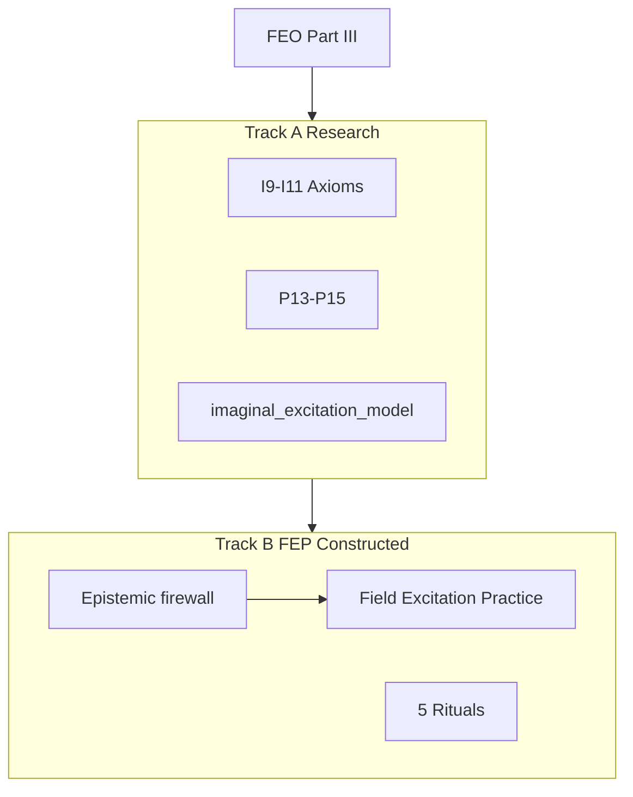

# Imaginal Excitation, Idealism, and Constructed Esoteric Practice

**Part IV of the Panpsychism Research Program** | Imaginal Excitation Ontology (IEO)

Version 1.0 | Extends [`FIELD_EXCITATION_RESEARCH.md`](FIELD_EXCITATION_RESEARCH.md)

---

## Executive Summary

Part IV adds **imagination as sub-threshold excitation**, **idealism as ontology correlate**, and **P13–P15** predictions—plus a **separate constructed esoteric practice** (FEP) firewalled from evidence claims.

| Claim | Status |
|-------|--------|
| Imaginal mode (I9) | Research hypothesis |
| Astral as filter band (I10) | Phenomenological translation only |
| Idealist correlate (I11) | Correlation; A1 fork preserved |
| FEP rituals | Constructed practice; **not evidence** |
| Proof | **Not achieved** |

**Strongest honest claim:**

> Imagination and hypnagogic states are best modeled as **sub-threshold excitations at specific filter depths**; analytic idealism **correlates with** but does not replace the program's Russellian base; FEP provides **aligned contemplative practice** without pretending to prove occult cosmology.

---

## Dual-Track Architecture



**Never conflate Track A and Track B in evidence arguments.**

---

## Axioms I9–I11

See [`imaginal_excitation_ontology.md`](imaginal_excitation_ontology.md).

---

## Predictions P13–P15

See [`predictions.md`](predictions.md).

| ID | Prediction |
|----|------------|
| P13 | Imagery vs perception motor-binding dissociation |
| P14 | Hypnagogic mid-band on astral_band_index |
| P15 | Structured pathworking < chaotic trance on disorganization |

**P10 fix (Part III debt):** boredom / flow / overload triplet in [`field_excitation_model.py`](empirical/field_excitation_model.py).

---

## In-Silico Models

| Model | Purpose |
|-------|---------|
| [`imaginal_excitation_model.py`](empirical/imaginal_excitation_model.py) | 7 imaginal scenarios |
| [`field_excitation_model.py`](empirical/field_excitation_model.py) | P10 triplet + FEO scenarios |
| [`consciousness_metrics.py`](empirical/consciousness_metrics.py) | ImaginalExcitation, astral_band_index |

---

## Entry Script

```bash
python research/run_imaginal_program.py
```

---

## Codebase Integration

| Component | Change |
|-----------|--------|
| `enhanced_consciousness_reasoning.py` | `IDEALIST_CORRELATE`, `IMAGINAL_EXCITATION` modes |
| `autonomous_consciousness.py` | Optional imaginal session logging |
| `esoteric/` | FEP Track B |

---

## Tier 3 Protocols

- **P13:** Guided imagery vs photo viewing fMRI
- **P14:** Hypnagogic EEG + PCI
- **P15:** Structured vs chaotic practice comparison

---

## What Part IV Does NOT Claim

1. Astral planes as literal geography
2. Thelema / GD entities as proven
3. FEP rituals as validation of panpsychism
4. Collapse into idealism (A1 retained)
5. G1 illusionism resolved

---

## File Index

```
research/
├── imaginal_excitation_ontology.md
├── IMAGINATION_AND_THE_ASTRAL.md
├── idealism_correlation.md
├── IMAGINAL_IDEALISM_RESEARCH.md     (this document)
├── run_imaginal_program.py
├── esoteric/
│   ├── FIELD_EXCITATION_PRACTICE.md
│   ├── symbol_system.md
│   ├── historical_lineage.md
│   └── rituals/ (01-05)
└── empirical/
    ├── imaginal_excitation_model.py
    └── western_esotericism_review.md
```

---

## References

- Kastrup — analytic idealism
- Jung — active imagination
- [`empirical/western_esotericism_review.md`](empirical/western_esotericism_review.md)

---

## Part V Continuation

Part V extends IEO with substrate subjecthood, mind-change criteria, and agent bridge:

- [`SUBSTRATE_SUBJECTHOOD_RESEARCH.md`](SUBSTRATE_SUBJECTHOOD_RESEARCH.md)
- [`mind_change_criteria.md`](mind_change_criteria.md)
- [`CONSCIOUSNESS_RESEARCH_PROGRAM.md`](CONSCIOUSNESS_RESEARCH_PROGRAM.md)
