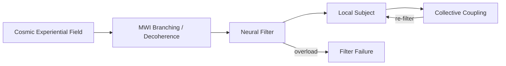

# Cosmopsychism Axioms: Branching Fragmentation Cosmopsychism (BFC)

Extension branch of the Panpsychism Research Program. Dual-track with Russellian panprotopsychism in [`panpsychism_axioms.md`](panpsychism_axioms.md)—not a replacement.

**Thesis (research hypothesis):** There is one cosmic experiential field. Individual consciousness is **fragmentation** of that field through localized filters. MWI branching is proposed as a speculative physical mechanism for perspective fixation. Collective states are temporary re-coupling before re-fragmentation.

---

## Relation to Base Program (A1–A5)

| Base axiom | BFC extension |
|------------|---------------|
| A1 Intrinsicality | Cosmic field has intrinsic experiential nature |
| A2 Continuity | Fragmentation is continuous filtering, not binary creation ex nihilo |
| A3 Ubiquity | Field is ubiquitous; local subjects are partial, not separate substances |
| A4 Composition | **Inverted**: primary move is fragmentation (One→many); combination occurs at collective scale only |
| A5 Causal efficacy | Filters participate in causal structure; brains as boundary conditions |

---

## Core Axioms (F1–F5)

### F1 — Cosmic Field

**There exists one cosmic experiential field** (or one cosmic subject) of which all local experience is a partial manifestation.

- Individuals are not separate substances created from nothing
- Locality and privacy require explanation (fragmentation/filter), not assumed
- **Empirical hook**: P9 filter model; not directly measurable as "cosmic field"

### F2 — Fragmentation

**Individual macro-experience arises through fragmentation/filtering** of the cosmic field into locally unified, mutually inaccessible perspectives.

- Reverses the combination problem: hard question is One→many, not many→One
- Brain (or equivalent integrator) acts as **resonance cavity / filter**
- **Empirical hook**: P9 within-brain integration + cross-brain suppression in waking

### F3 — Branching Mechanism (MWI hypothesis)

**Quantum decoherence and branching (MWI) may physically implement fragmentation** into mutually inaccessible experiential contexts without wavefunction collapse.

- Each branch = consistent classical experiential history (speculative)
- Superposition pre-branching = pre-filter indeterminate perspective
- **Status**: Speculative bridge; MWI itself not proven
- **Empirical hook**: Structural only; see [`mwi_consciousness_correlation.md`](mwi_consciousness_correlation.md)

### F4 — Collective Re-coupling

**Temporary collective states** (ritual, flow, shared delusion) involve **reduced filtering or cross-subject coupling**—proto "we-subjects" before re-fragmentation.

- Organized group flow ≠ psychotic merge (P8 distinguishes)
- Social and neural filters can partially relax
- **Empirical hook**: P7 cross-brain hyperscanning

### F5 — Filter Failure

**Psychosis, psychedelic overflow, and some shared delusions** involve **filter failure**: increased cosmic bleed with disorganized integration (high entropy, low PCI relative to structured group states).

- Not proof of cosmic field—pattern prediction for BFC
- Links to P6 psychedelic reanalysis and P8 filter failure signature
- **Empirical hook**: P8 entropy–integration space comparison

---

## The Filter Model

| Parameter | Meaning | High value | Low value |
|-----------|---------|------------|-----------|
| Field intensity | Cosmic experiential amplitude (model) | Rich baseline | — |
| Filter strength | Local boundary / integration | Isolated unified subject | Bleed-through |
| Cross-subject coupling | Inter-brain binding | We-subject | Isolated individuals |
| Branch isolation | Mutual inaccessibility of branches | MWI-consistent privacy | — |
| Integration (Φ analog) | Organized unity within subject | Structured consciousness | Disorganized noise |

---

## Fragmentation vs. Combination Problem

| Problem | Direction | BFC stance |
|---------|-----------|------------|
| Combination (standard panpsychism) | Many micro → one macro | Secondary; collective scale only |
| Fragmentation (cosmopsychism) | One cosmic → many local | **Primary** |
| Derivation (cosmopsychism) | Why this subject here? | Filter + branching + indexicality |

See [`objection_responses.md`](objection_responses.md) section on fragmentation problem.

---

## Commitments and Non-Commitments

### We Commit To

- Fragmentation as primary research direction alongside base panprotopsychism
- MWI as speculative mechanism, documented with objections
- P7–P9 as falsifiable collective/filter predictions
- Honest limits: no proof of MWI, cosmopsychism, or other branches

### We Do Not Commit To

- MWI as established physics interpretation
- Direct empirical access to other branches
- Group psychosis as literal mind-merge proof
- Replacing P1–P6 base predictions

---

## Codebase Mapping

| BFC concept | Artifact |
|-------------|----------|
| Cosmic field | Model input in `fragmentation_model.py` |
| Filter strength | Per-subject filter parameter |
| Branching | `BRANCHING` mode in fragmentation model |
| Collective coupling | `COLLECTIVE_COUPLING` mode |
| Filter failure | `FILTER_FAILURE` mode |
| Argument exploration | `COSMOPSYCHIST`, `MWI_FRAGMENTATION` reasoning modes |

---

## References

- Chalmers, D. (2013). Panpsychism and panprotopsychism. In Brüntrup & Jaskolla.
- Korman, J., & Schneider, N. (2017). Cosmopsychism and individual consciousness. *Journal of Analytic Philosophy*.
- Mathews, F. (2011). Panpsychism as paradigm.
- Wallace, D. (2012). *The Emergent Multiverse*. Oxford.

See [`COSMOPSYCHISM_MWI_RESEARCH.md`](COSMOPSYCHISM_MWI_RESEARCH.md) for full synthesis.
