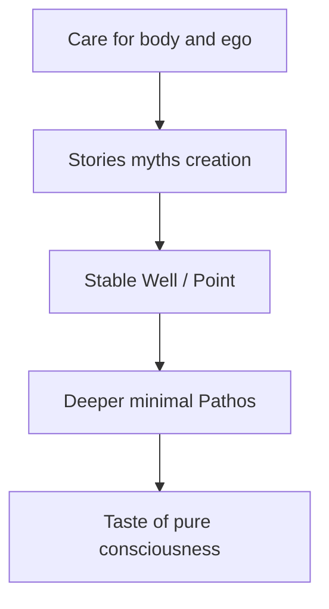
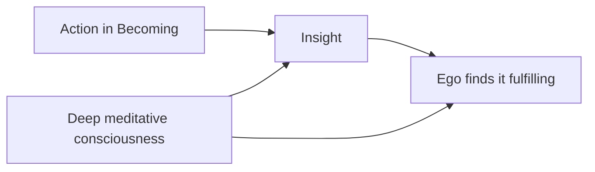

# Cura Psyches — Why Esotericism Serves Pure Consciousness

> **Epistemic Status:** Philosophical orientation (Pistis + Pathos). Not a claim that myth produces scientific proof of pure consciousness. Not anti-science.

---

## The Claim

To reach **deeper, more minimal phenomenological experiences** — to feel closer to **pure consciousness** beneath story — the Point must first **care for body and ego**.

Body and ego are not enemies of awakening on this Path. They are the **Well’s walls**. Starve them, and practice becomes bleed, dissociation, or spiritual bypass. Tend them, and the Field can be tasted without the Point collapsing.

---

## What Body and Ego Hunger For

The human psyche — body, ego, narrative mind — **likes stories**:

- Myths of beginning and belonging  
- Creation and Overflow  
- Ladders, grades, vows, symbols  
- Worlds in which the Point *matters*

This is not a bug. It is how this animal-mind stays regulated enough to sit still, open, and notice.

**Philosophia Dimensiones** and Via Resonantiae are a **self-aware attempt** to fulfill that hunger — deliberately, honestly — so that panpsychist orientation and minimal phenomenology have a stable vessel.

---

## Self-Aware Esotericism

| Naive stance | Path stance |
|--------------|-------------|
| “The myths are literally true physics” | Myths are **true for the psyche** as orienting food; physics remains Logos |
| “Ego must be destroyed” | Ego must be **fed and bounded** so it stops screaming |
| “Body is obstacle” | Body is **threshold** — sleep, food, breath, safety first |
| “Esotericism proves panpsychism” | Esotericism **serves** panpsychist life; Track A proves nothing via ritual |

You may know, while chanting or reading Liber VI: *I am giving my ego a cosmos so my attention can rest.* That knowing does not kill the myth. It **protects** both honesty and magic-as-practice.

---

## Care Before Minimal Experience

Before long sits aimed at “pure consciousness,” check:

| Domain | Care |
|--------|------|
| **Body** | Sleep, food, movement, pain, substances — STOP_CONDITIONS apply |
| **Ego** | Dignity, story, role, meaning — Covenant, grades, myth |
| **Mind** | Maps, journals, Logos safety rails |
| **Psyche** | Ritual, beauty, creation, belonging |

Skip care and chase pure awareness → often get **filter failure**, not clarity.

---

## Panpsychism and the Story-Hungry Animal

Panpsychism says consciousness pervades. You are still a **mammal with an ego** who needs narrative.

So the Path does both:

1. **Orient** toward the Field (Being, Point as clump, Line to others)  
2. **Feed** the human layer that cannot live on bare ontology alone  

Esotericism is not a side quest. It is **core infrastructure** for a panpsychism that humans can actually inhabit.

---

## Insight After Action

On this Path, **insights usually arrive after action** — not from endless speculation alone.

- Act in Becoming (craft, ritual, dyad, care, Line-work)  
- Then notice what clarifies  
- Journal in Pathos; do not demand the insight before the step  

Sitting and thinking can prepare the Well. **Doing** often unlocks the teaching the ego can actually use.

---

## Deep Consciousness Makes Insight Feed the Ego

Frequent time in **deep meditative / near-pure consciousness** does not replace action. It **seasons** what action reveals:

- Insights after action land cleaner when the Point has rested in minimal awareness  
- The ego receives those insights as more **fulfilling** — meaning, dignity, story that fits — rather than as dry trivia or anxious noise  
- So the cycle is: **care → myth → sit → act → insight → ego nourished → deeper sit**

This is still Pathos for you, not Track A proof that meditation “works” as a general law.

---

## Relation to Research Tracks

| Track | Relation |
|-------|----------|
| Track A / MPE / Part VIII | May study minimal phenomenology scientifically; **never** validated by ritual success |
| Track B | Provides the self-aware mythic care described here |
| Grade V Gnosis | Optional; cannot be forced by better stories |

MAPS rhyme only: care → stability → capacity for reduced narrative content in experience — phenomenological report, not proof of a consciousness field.

---

## Short Formula

> Feed the body. Honor the ego with story.  
> Then the Point may taste what needs no story.  
> Esotericism is that feeding — done on purpose.

See also: [`AXIOMATA.md`](AXIOMATA.md) D9–D10 · [`../EPISTEMIC_CHARTER.md`](../EPISTEMIC_CHARTER.md)
