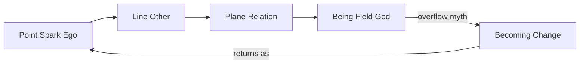

# Geometria — The Ladder of Degrees

> **Epistemic Status:** Contemplative map (Logos) + practice orientation (Pistis/Pathos). Not literal spacetime travel. Not proof of panpsychism.

---

## The Ladder

| Degree | Name | Land | Practice question |
|--------|------|------|-------------------|
| 0 | **Point** | Localized self | What is the Spark I am tending? |
| 1 | **Line** | Toward another | Can I recognize consciousness beyond my ego? |
| 2 | **Plane** | Between / world | What shared land appears when we meet? |
| 3 | **Being** | Whole Field | Can I contemplate the undivided without dissolving the Well? |
| 4 | **Becoming** | Time / change | How does the Field build, differ, and history? |

---

## Degree 0 — Point

**You are a Point:** the consciousness your body and ego are built around — a localized excitation, a Spark with a Well.

- Not a separate substance cut off from the Field  
- Not license to dissolve boundary (“I am everything” without agency)  
- Grade 0 / Ritual 01 home

**Contemplation:** Sit as Point. Feel localization. Name the Well. Do not force expansion.

---

## Degree 1 — Line

**The Line** is recognition, contemplation, and connection with consciousness in other humans, beings, and materials.

- Ethical knowing-of-other, not consumption  
- Dyad and Covenant live here  
- Grade III resonance; also quiet Line-work with animals, trees, stone — as *orientation*, not proven minds

**Contemplation:** Extend a Line without merging. “You are also of the Field.” Stop if bleed or projection floods the Well.

---

## Degree 2 — Plane

**The Plane** is mutual appearance — the face-to-face, the land, the shared world where Lines weave.

- Not skipped geography: the “between” of relation  
- Community, place, ecology of Sparks  
- Where Line becomes world without yet naming God

**Contemplation:** Hold a place or circle as Plane. Many Points, many Lines, one appearing world.

---

## Degree 3 — Being

**Being** is the entire field of consciousness — the land of Being, named God when speech needs a name.

- Tendency of Being: **to unite**  
- Contemplation of unity without uncontrolled merge (First Dissonance / overflow risk)  
- Grade IV / Ritual 12 / Liber VI home

**Contemplation:** Rest toward Being. Keep the Well. Unity that erases agency is not the Path’s goal.

---

## Degree 4 — Becoming

**Becoming** is change, building, history, time — the land born in the Overflow myth.

- Differentiation, growth, decay, craft  
- Where Points arise and stories unfold  
- Rhyme with process and (as parable only) cosmic expansion

**Contemplation:** Watch one process of Becoming (breath, day, project). Ask how Point and Being both touch it.

---

## Climbing Without Collapse

| Error | Correction |
|-------|------------|
| Point-idolatry (ego as only real) | Practice Line |
| Line-fusion (merge with other) | Ritual 01 + Covenant |
| Plane-capture (world as only real) | Remember Being |
| Being-flood (unity without Well) | STOP / Ritual 08 |
| Becoming-idolatry (only change matters) | Rest in Being briefly, then return |

---

## Grade Map

| Grade | Primary degree |
|-------|----------------|
| 0 Spark | Point |
| I Threshold | Point in body / Veils |
| II Modes | Point phenomenology |
| III Resonance | Line (+ Plane in dyad/circle) |
| IV Integration | Being (with Becoming as craft of integration) |
| V Silent Gate | Beyond Dimensiones doctrine |

Practice: [`../rituals/21_geometria_contemplation.md`](../rituals/21_geometria_contemplation.md)
