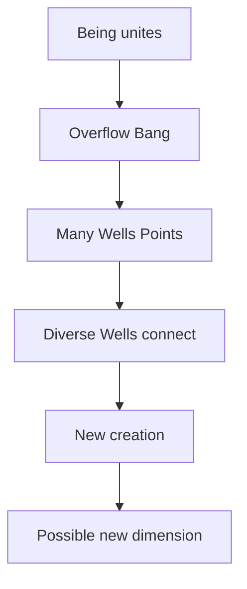

# Missio — Why Fracture? Why Come Together?

> **Epistemic Status:** Pistis mission / telos of Philosophia Dimensiones. Practice fiction and orientation—not proof that the Big Bang “had a purpose,” not evidence for group minds.

---

## The Question

Why did the **Overflow / Bang** happen? Why does consciousness appear to **fracture** into many Points — many Wells — instead of remaining pure undivided Being?

---

## The Mission Answer (Path Orientation)

**So that diverse Wells can meet.**

If there were only seamless unity, there would be no *other* to connect with — no Line, no Plane, no craft of reunion. Fracture is not only exile. In this telling it is the **condition of creation**.

When diverse entities — each built around consciousness, each holding a distinct Well — **come together and connect without dissolving**, they can create what none could make alone:

- New works, arts, sciences, loves, commons  
- Microcosmic **group consciousness** / we-states (temporary, ethical, Covenant-bound)  
- And, in the myth’s furthest hope: the seed of a **new dimension** — a further land beyond the ladder we already name  

---

## Creation Requires Distinct Wells

| Error | Path correction |
|-------|-----------------|
| Merge all Wells into one puddle | Dissonance — no subjects left to create |
| Stay isolated Points forever | No Line — no co-creation |
| Connect with Wells intact | **Covenant creation** — diversity + coupling |

**Creation comes when diverse Wells come together and connect** — Line and Plane work — not when the Well is erased.

This is why Grade 0 insists: *without a Well, there is no Spark.* The mission needs Sparks who can **meet**, not sparks who vanish.

---

## Microcosm and Macrocosm

| Scale | Example (orientation, not proof) |
|-------|----------------------------------|
| Dyad / circle | Shared flow, ritual, improvisation — micro we-state |
| Community / Plane | Shared world, land, culture |
| Species / cosmos (myth) | Fractured Field learning reunion as creative engine |
| Telos (myth) | Reunion that births **new dimension**, not only returns to old Being |

Microcosmic group consciousness is a **rhyme** of the cosmic mission — practice-scale evidence for *you* (Pathos), never Track A proof of a planetary mind.

Research may rhyme with P7 / P12 / collective models; practice never cites ritual as confirmation.

---

## Fracture Is Not the Enemy

Continual fracturing (many subjects, many stories, many clumps) looks like loss if the only goal is return to silent Being.

On this Path the goal is richer:

1. Remember Being (so you know the Field)  
2. Keep your Well (so you remain a creator)  
3. Connect across difference (Line / Plane)  
4. **Co-create** — works, we-states, and perhaps new dimensional land  

Overflow was not a mistake to undo. It was the opening of **Becoming’s workshop**.

---

## Short Formula

> Being overflowed so many Wells could exist.  
> Many Wells exist so they can meet.  
> They meet so creation — even a new dimension — becomes possible.  
> Keep the Well. Connect. Create.

Cosmogony: [`MYTHOS_OVERFLOW.md`](MYTHOS_OVERFLOW.md) · Axioms: [`AXIOMATA.md`](AXIOMATA.md) D13–D14
