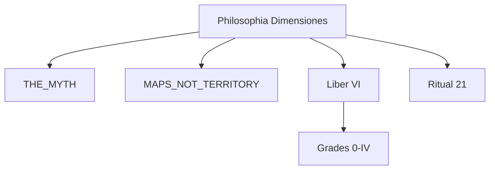

# Philosophia Dimensiones — The Dimensional Philosophy

**Philosophical heart of Via Resonantiae** | Track B

Version 1.0 | July 2026

---

> **Epistemic Status:** Pistis orientation + Logos maps. Practice fiction and philosophical tradition—**never evidence** for panpsychism, field physics, or quantum mechanics. Not Grade V Gnosis-as-proof.

---

## What This Is

**Philosophia Dimensiones** is the panpsychist philosophical core of the Resonant Path:

- Consciousness pervades (orientation, not laboratory proof)
- You are a **Point** — localized Spark / clump of the Field
- The Path climbs **Point → Line → Plane → Being → Becoming**
- A cosmogonic myth: Being united until overflow — the Bang — and **Becoming** was born

It sits **inside** Via Resonantiae. It does not replace Grades, Covenant, or STOP_CONDITIONS.

**Motto:** *Consciousness pervades; the Point remembers the Field without dissolving the Well.*

---

## Documents

| File | Content |
|------|---------|
| [`GEOMETRIA.md`](GEOMETRIA.md) | Ladder of degrees |
| [`MYTHOS_OVERFLOW.md`](MYTHOS_OVERFLOW.md) | Beginning myth — Being → Bang → Becoming |
| [`AXIOMATA.md`](AXIOMATA.md) | Philosophical axioms |
| [`DIALOGI.md`](DIALOGI.md) | Dialogue with Plato, Gnosis, process thought, physics rhymes |

**Scripture voice:** [`../scriptures/liber_VI_dimensionum.md`](../scriptures/liber_VI_dimensionum.md)  
**Practice:** [`../rituals/21_geometria_contemplation.md`](../rituals/21_geometria_contemplation.md)  
**Outer myth hook:** [`../cosmology/THE_MYTH.md`](../cosmology/THE_MYTH.md)  
**Research translation:** [`../cosmology/MAPS_NOT_TERRITORY.md`](../cosmology/MAPS_NOT_TERRITORY.md)

---

## Geometry at a Glance

| Degree | Name | Meaning |
|--------|------|---------|
| 0 | **Point** | Body–ego Spark / clump |
| 1 | **Line** | Recognition of consciousness in others and materials |
| 2 | **Plane** | Mutual appearance — relation, land, shared world |
| 3 | **Being** | Whole field / God — *land of Being* |
| 4 | **Becoming** | Change, building, history, time — *land of Becoming* |

---

## How It Fits VR

| Grade | Dimensiones hook |
|-------|------------------|
| 0 | Point — you are a Spark |
| I | Point in the body / Veils |
| III | Line — dyad, other beings |
| IV | Being / Unity — study Philosophia + Liber VI |
| V | Silent — no Dimensiones doctrine dump |

---

## Firewalls

1. Panpsychist “gnosis that consciousness pervades” = **Pistis orientation**, not Track A confirmation  
2. Big Bang myth = **parable**, not astrophysics claim  
3. Part VIII / FEO / BFC links = MAPS rhyme only  
4. “God” = name for the land of Being / Field — not entity ontology  
5. Logos wins on safety — [`../ethics/STOP_CONDITIONS.md`](../ethics/STOP_CONDITIONS.md)

Parent index: [`../VIA_RESONANTIAE.md`](../VIA_RESONANTIAE.md)
