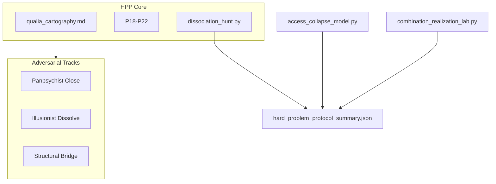

# Hard Problem Protocol — Part VI Master Synthesis

**Adversarial triangulation** for the explanatory gap | Extends [`CONSCIOUSNESS_RESEARCH_PROGRAM.md`](CONSCIOUSNESS_RESEARCH_PROGRAM.md)

Version 1.0 | July 2026

---

## Executive Summary

Part VI does **not** solve the hard problem. It builds the **arena** where three serious responses fight on shared predictions until one loses.

| Track | Success tier | Current standing |
|-------|--------------|------------------|
| Panpsychist Close (Parts I–V) | Close the gap | **open** |
| Illusionist Dissolve (G1) | Dissolve the gap | **open** |
| Structural Physicalism | Bridge via cartography | **open** |

**Strongest honest claim:**

> We still cannot derive qualia from physics — but we can **force rival theories to make conflicting predictions on the same experiential invariants** and update the ledger when a track loses.

---

## Architecture



---

## Key Artifacts

| Artifact | Role |
|----------|------|
| [`hard_problem_protocol.md`](hard_problem_protocol.md) | Tournament rules, success tiers |
| [`qualia_cartography.md`](qualia_cartography.md) | Q1–Q10 experiential invariants |
| [`dissociation_hunt.py`](empirical/dissociation_hunt.py) | Adversarial scenario battery |
| [`access_collapse_model.py`](empirical/access_collapse_model.py) | P18 illusionist stress test |
| [`combination_realization_lab.py`](empirical/combination_realization_lab.py) | P22 unity deathmatch |
| [`neurophenomenology_protocol.md`](empirical/neurophenomenology_protocol.md) | Track C first-person template |
| [`run_hard_problem_protocol.py`](run_hard_problem_protocol.py) | Entry script |

---

## Predictions P18–P22

See [`predictions.md`](predictions.md).

| ID | Decisive question |
|----|-------------------|
| P18 | Residual integration after access-only collapse? |
| P19 | Suffering without self-model update? |
| P20 | Insight before reportable content? |
| P21 | Structure determines qualia-type? |
| P22 | Integration unity > summing? |

---

## Reasoning Modes

In [`core/enhanced_consciousness_reasoning.py`](../core/enhanced_consciousness_reasoning.py):

- `ILLUSIONIST_DISSOLVE` — G1, P18
- `STRUCTURAL_PHYSICALIST` — cartography, P21
- `ADVERSARIAL_ARBITER` — scoreboard from hunt/collapse results

---

## Dual-Track Reminder

| Track | Path | HPP role |
|-------|------|----------|
| A — Research | `research/empirical/` | Tournament evidence |
| B — FEP | `research/esoteric/` | **Never updates scoreboard** |

Neurophenomenology protocol is **not** FEP — no rituals, no cosmology.

---

## Cross-Links

- Part V: [`SUBSTRATE_SUBJECTHOOD_RESEARCH.md`](SUBSTRATE_SUBJECTHOOD_RESEARCH.md) (G1, mind-change)
- Part I: [`PANPSYCHISM_RESEARCH.md`](PANPSYCHISM_RESEARCH.md)
- G1 review: [`empirical/illusionism_g1_review.md`](empirical/illusionism_g1_review.md)
- Objections: [`objection_responses.md`](objection_responses.md)
- Part VII Track B: [`esoteric/via_resonantiae/VIA_RESONANTIAE.md`](esoteric/via_resonantiae/VIA_RESONANTIAE.md) — addresses Pathos/Pistis/Gnosis; **does not resolve HPP**

---

## Quick Start

```bash
python research/run_hard_problem_protocol.py
# or
python research/run_consciousness_program.py --adversarial
```

Output: `research/empirical/hard_problem_protocol_summary.json`

All outputs: **simulation — hard problem NOT solved**.
